# BaronyPA
A mumble plugin that adds positional audio support for Barony.  

## Installation

Windows

- Method 1: Get the Mumble Plugin file from [Releases](https://github.com/shaneMenzies/BaronyPA/releases), and open it with Mumble.  

  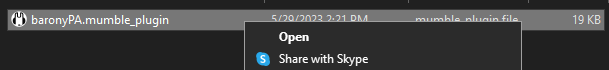  

- Method 2: Place the compiled baronyPA.dll file in your Mumble plugin directory (%appdata%/Mumble/Plugins).  

  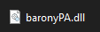
    

Linux

- Method 1: Get the Mumble Plugin file from [Releases](https://github.com/shaneMenzies/BaronyPA/releases), and select it in Mumble's "Install plugin..." dialog.  

  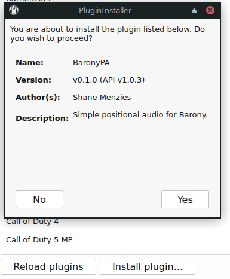  

- Method 2: Place the compiled libbaronyPA.so file in your Mumble plugin directory (~/.local/share/Mumble/Mumble/Plugins)

  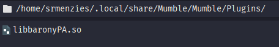  

### Enabling  

For the plugin to work, it needs to have both "Enable" and "PA" checked for it, and "Link to Game and Transmit Position" needs to be set.

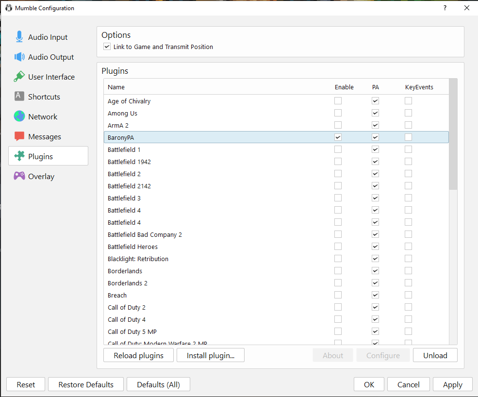  

Currently, when enabled, the plugin should send a message that its waiting for Barony to be opened.  

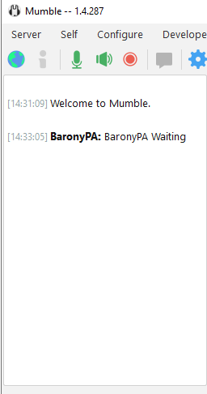  

Once Barony is opened, there should be another message telling you that the plugin is linked.

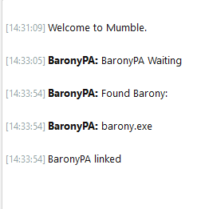  

## Building

Windows

1. Open the plugin directory in a command prompt with the required toolset [See Here](https://learn.microsoft.com/en-us/cpp/build/building-on-the-command-line?view=msvc-170).  

2. Use CMake to generate NMake Makefiles.  

  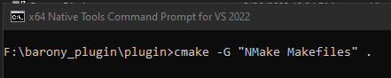  

3. Build the plugin using NMake  

  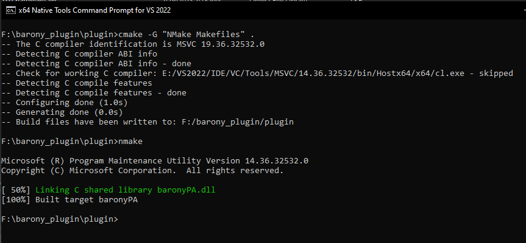  

Linux

1. Use CMake to generate the Makefile  

  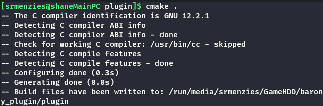  

2. Build the plugin using Make  

  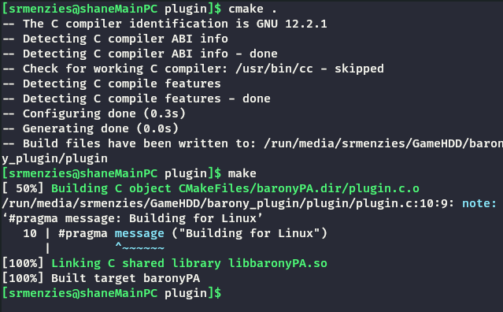

### Bundling  

To make the Mumble Plugin bundle, you need to make a .zip archive with the Windows and Linux plugins, and the manifest.xml file.  

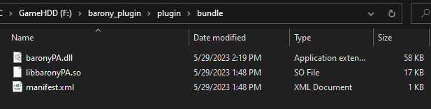  

Renaming the file extension from .zip to .mumble_plugin will make it a valid Mumble Plugin file.
